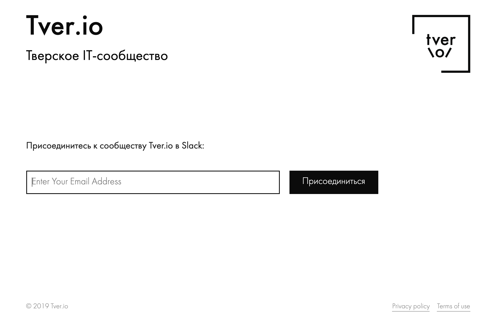

Slack Invite Automation
------------

[](https://travis-ci.com/tverio/slack-invite-automation)

A tiny web application to invite a user into Tver.op. [Original repo](https://github.com/outsideris/slack-invite-automation)

## Settings

You can set variables for your own purpose in `config.js` or environment variables.

### `config.js`

Fill out `config.js` as your infomation.

* `community`: your community or team name to display on join page.
* `slackUrl` : your slack team url (ex.: socketio.slack.com)
* `slacktoken` : Your access token for Slack. (see [Issue token](#issue-token))
* `inviteToken`: An optional security measure - if it is set, then that token will be required to get invited.
* `recaptchaSiteKey`: An optional security measure - if it is set, and `recaptchaSecretKey` is set, then a captcha will be required to get invited.
* `recaptchaSecretKey`: An optional security measure - if it is set, and `recaptchaSiteKey` is set, then a captcha will be required to get invited.
* `locale`: Application language (currently `cs`, `de`, `en`, `es`, `fr`, `it`,  `ja`, `ko`, `nl`, `pl`, `pt`, `pt-BR`, `tr`, `zh-CN` and `zh-TW` available).
* `subpath`: Sub-path in URL. For example, if `/example` is set, it's served in `/example`, not `/`. Default is `/`.

### Environment Variables
You can set environment variables directly or in `.env` file.
If you want to use a `.env` file, create a file in the root called `.env` with the following key/value pairs.
(`.env` files are added to the `.gitignore`.)

- `COMMUNITY_NAME` : Your community or team name to display on join page.
- `SLACK_URL` : Your Slack team url (ex.: socketio.slack.com)
- `SLACK_TOKEN` : Your access token for Slack. (see [Issue token](#issue-token))
- `INVITE_TOKEN`: An optional security measure - if it is set, then that token will be required to get invited.
- `RECAPTCHA_SITE`: An optional security measure - used to enable reCAPTCHA.
- `RECAPTCHA_SECRET`: An optional security measure - used to enable reCAPTCHA.
- `LOCALE`: Application language (currently `cs`, `de`, `en`, `es`, `fr`, `it`, `ja`, `ko`, `nl`, `pl`, `pt`, `pt-BR`, `tr`, `zh-CN` and `zh-TW` available).
- `SUBPATH`: Sub-path in URL. For example, if `/example` is set, it's served in `/example`, not `/`. Default is `/`.

**Sample**

```
COMMUNITY_NAME=socketio
SLACK_URL=socketio.slack.com
SLACK_TOKEN=ffsdf-5411524512154-16875416847864648976-45641654654654654-444334f43b34566f
INVITE_TOKEN=abcdefg
LOCALE=en
```

You can test your token via curl:

  ```shell
   curl -X POST 'https://YOUR-SLACK-TEAM.slack.com/api/users.admin.invite' \
   --data 'email=EMAIL&token=TOKEN&set_active=true' \
   --compressed
  ```

### Zeit
* Configure secret:
  ```bash
  now secret add slack-token <slack token here>
  ```
* Deploy
  ```bash
  npm run deploy
  ```
  or
  ```bash
  now
  ```

## Run
[Node.js](http://nodejs.org/) is required.

```shell
$ git clone git@github.com:tverio/slack-invite-automation.git
$ cd slack-invite-automation
$ npm install
$ npm start
```

You can access <http://localhost:3000> on your web browser.



## Issue token
**You should generate the token in admin user, not owner.** If you generate the token in owner user, a `missing_scope` error may occur.

There are two ways to issue the access token.

### Legacy tokens
1. Visit <https://api.slack.com/custom-integrations/legacy-tokens>.
1. Click `Create token`.

    

### OAuth tokens
1. Visit <https://api.slack.com/apps> and Create New App.

    

1. Click "Permissions".

    

1. In "OAuth & Permissions" page, select `admin` scope under "Permission Scopes" menu and save changes.

    

1. Click "Install App to Workspace".

    

1. Visit <https://slack.com/oauth/authorize?&client_id=CLIENT_ID&team=TEAM_ID&install_redirect=install-on-team&scope=admin+client> in your browser and authorize your app.
    * This form requires the `client` permission. Otherwise, you can see `{"ok":false,"error":"missing_scope","needed":"client","provided":"admin"}` error.
    * Your `TEAM_ID` is the subdomain for your slack team, e.g. myteam.slack.com - your TEAM_ID is `myteam`.
    * Your `CLIENT_ID` found in "Basic Information" section for your App.
    * You will be shown a `Installed App Settings > OAuth Tokens for Your Team` screen.
    * You can test auto invites with curl by providing the `OAuth Access Token`.
    ```sh
    curl -X POST 'https://myteam.slack.com/api/users.admin.invite' \
   --data 'email=test@email.com&token=OAuthAccessToken&set_active=true' \
   --compressed
   ```

    

## Badge


You can use the badge to show status of user in your slack.

* With default colors:
    ```
    
    ```

* With custom colors:

    * `?colorA=abcdef` Set background of the left part (hex color only)
    * `?colorB=fedcba` Set background of the right part (hex color only)

    ```
    
    ```
